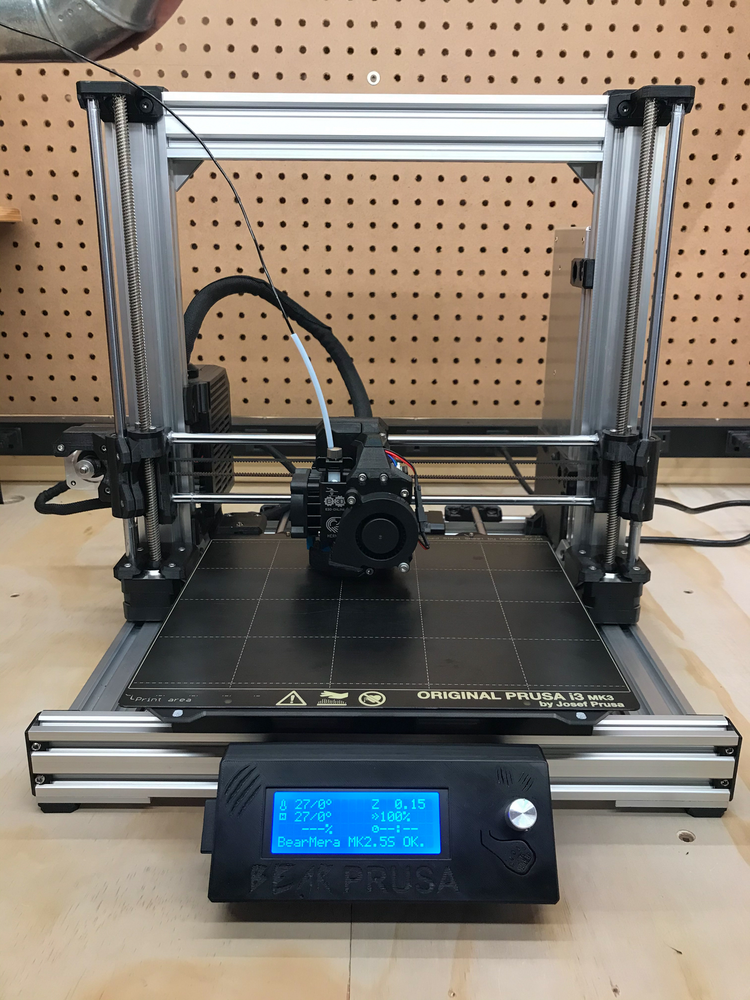
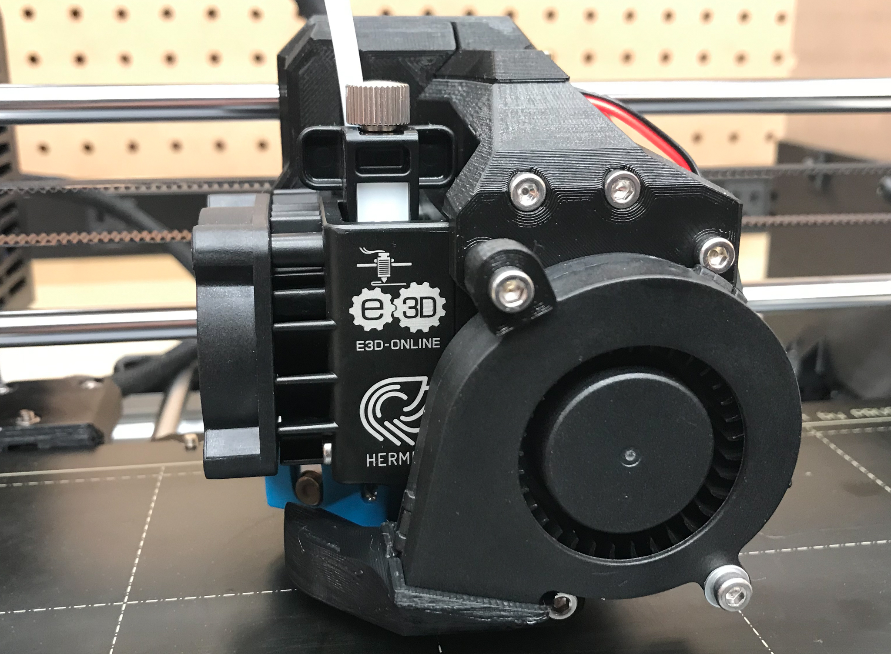
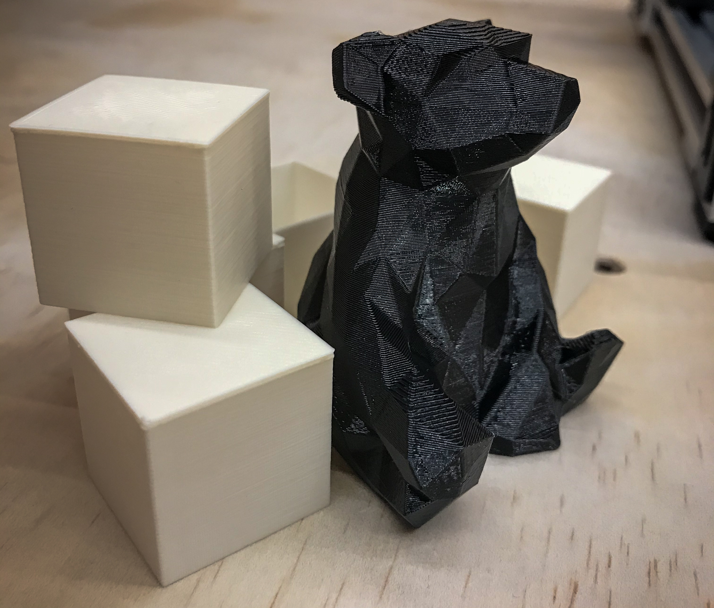

# BearMera MK2.5S Experimental Firmware 3.9.0

#### _NOTICE: This modified firmware is not endorsed, maintained or supported by Prusa Research, Grégoire Saunier, or the Bear Upgrade community in general. Using this unofficial firmware will void the Prusa warranty on your electronics, and is done entirely at your own risk._

---

### What the heck is a BearMera?!
Generally speaking, it's Grégoire Saunier's redesigned x-axis and extruder for Prusa i3-based 3D printers combined with E3D-Online's Hemera extrusion system.  In my case specifically, it's a built-from-scratch Prusa i3 MK2.5S on Grégoire's Prusa i3 Bear Upgrade frame.  

* Bear Extruder and X-Axis https://github.com/gregsaun/bear_extruder_and_x_axis
* Bear Upgrade (Frame) https://github.com/gregsaun/prusa_i3_bear_upgrade  
* E3D-Online Hemera extrusion system https://e3d-online.com/e3d-hemera-175-kit

### So...who is this firmware/repository for? 
_Myself_, primarily.  Others who want to modify their printer to work with the BearMera extruder may find some of the firmware modifications I have made useful, so I am documenting those changes and providing the source code here.

### Where are the .hex files?
**Compiled .hex firmware files are not, and will not be provided**.  Using modified firmware on your 3D printer can be dangerous, particularly if that firmware is not intended for your specific printer's geometry and hardware configuration.  Given that this firmware was built for an uncommon printer configuration (Bear 2.1-ish MK2.5S, Bear X-Axis 0.70-alpha, BearMera Extruder), it is unlikely that it will work as-is for the vast majority of people.  To use the modified firmware, you will have to build it from source yourself.

### How do I build the firmware from source?
Prusa Research provides build instructions in their GitHub repository [here](https://github.com/prusa3d/BearMera-Firmware).  I personally build the source using the provided `PF-build.sh` script in a Ubuntu docker container on a Windows 10 64-bit machine.

### What parts of the firmware have been modified?
1) The `1_75mm_MK25S-Bear-RAMBo13a-E3DHemera.h` file in the `variants` folder has been added.  This file is based on the original `MK25S-RAMBo13a` configuration file, with the following modifications:

    * `#define NOZZLE_TYPE "E3DHemera"`  
    _This is a cosmetic change.  Returned as part of the response to the "PRUSA Rev" command, and  displayed on the LCD controller's support menu._

    * `#define CUSTOM_MENDEL_NAME "BearMera MK2.5S"`  
    _Another largely cosmetic change.  Returned as part of the response to `M115`, and displayed on the main LCD info screen._

    * `#define DEFAULT_AXIS_STEPS_PER_UNIT   {100,100,3200/8,409}`  
    _Sets the default steps/mm for the Hemera extruder to E3D's recommended starting value of 409.  All other values remain at defaults.  Can be modified at any time via the `M92` command._

    * `#define X_MAX_POS` (as well as X min, Y max and Y min)  
    _I set these values so that I could move all axes as far as possible in any direction whether or not the nozzle was actually over the heatbed.  For me, X max = 240, which is as far right as the extruder can go before hitting the Z-axis upright.  X min = -12, at which point the extruder triggers the X endstop.  Y max = 195, which is as far forward as the bed can come without a risk of the PINDA probe hitting one of the steel sheet guide screws at the back of the heatbed.  Y min = -12, which is as absolutely far back as the heatbed can go before the stepper starts skipping.  Both Z limits remain at the default values (210, 0.15)._

    * `#define FANCHECK` is commented out  
    _This disables hotend fan RPM monitoring, which is not supported on the 2-wire fan that ships with the Hemera extruder kit.  Disabling this check allows the Self Test procedure to complete successfully by reverting to the old-style manual "fan spinning? yes/no" confirmation._

    * `#define FILAMENT_SENSOR` and `#define IR_SENSOR` are both commented out  
    _There is no support for a filament sensor on the current version of the BearMera extruder._

    * `#define DEFAULT_PWM_MOTOR_CURRENT_LOUD  {540, 830, 750}` increases the current to the extruder stepper by increasing the last parameter from _500_ to _750_.  **This modification is currently still being tested/tweaked!**  The stepper motor that ships with the Hemera is rated for DC 1.33A, vs. the Prusa stock motor which their documentation says is rated for 1A.  This setting results in an Eref of 0.6229V, or roughly 0.78A, which is well below E3D's recommended current, but significantly higher than the stock Prusa value.  I arrived at the 750 value by raising the value from 500 in increments of 50 until my particular Hemera's stepper stopped missing steps while loading PETG filament.  I am currently (no pun intended) testing to see if the increased current results in thermal issues on the Mini-RAMBo or extruder and will adjust if necessary.

    * `#define X_PROBE_OFFSET_FROM_EXTRUDER` (as well as Y probe offset)  
    _These values represent the X/Y offsets from the center of the extruder's nozzle to the center of the PINDA probe.  The X offset changes to 35.75 and the Y offset changes to 18.7.  There is no change to the Z offset._

2) In `Marlin_main.cpp` I changed the bootup text that displays on the LCD.  Not necessary, but it helps make it perfectly clear that we have deviated from the Prusa stock firmware.

    * _In the `void lcd_splash()` function, I changed:_  
    `lcd_puts_P(PSTR("\n Original Prusa i3\n   Prusa Research"));`  
    _to_  
    `lcd_puts_P(PSTR("\n  i3 Bear + Hemera\n    Experimental"));`

3) I tweaked the default home offset position in `ConfigurationStore.cpp`.  This isn't really necessary, as it can be modified at any time via the `M206` command, and any previously stored values will override these defaults anyway.  I just got tired of having to restore them after clearing EEPROM while fiddling with calibration settings.

    * _In the `static const M500_conf default_conf PROGMEM =` section, immediately underneath `DEFAULT_XJERK`, I changed `{0,0,0}` to `{1.5,0.5,0}`, which puts the nozzle at precisely (visually, at least) the correct position when the axes are moved to position 0,0 via the LCD._

4) It turns out that the nozzle-to-probe offsets that are set in the main configuration file are not taken into account during a full XYZ calibration.  The coordinates of the four main calibration points have been hard-coded in `xyzcal.cpp` based on the default offsets, which prevents the PINDA probe from searching anywhere even remotely close to the actual calibration points with the BearMera extruder.  I modified the hard-coded values to get them as close as possible to the actual calibration points.

    * `const int16_t xyzcal_point_xcoords[4] PROGMEM = {1200, 22000, 22000, 1200};`  
    _changes to_  
    `const int16_t xyzcal_point_xcoords[4] PROGMEM = {-75, 20725, 20725, -75}`

    * `const int16_t xyzcal_point_ycoords[4] PROGMEM = {700, 700, 19800, 19800};`  
    _changes to_  
    `const int16_t xyzcal_point_ycoords[4] PROGMEM = {-200, -200, 18200, 18200};`  

    I say "_as close as possible_" because using the center coordinates for the 1st and 2nd calibration points causes the circular "search pattern" used by the calibration process to fall outside the actual range of motion of the Y-axis.  I was able to cheat these values forward enough that the procedure can still find and hone in on the 1st point while remaining within the printer's range of motion.

    Unfortunately, I have yet to successfully complete a calibration cycle, as the 2nd calibration point on my heatbed is never found.  (I had major issues with this 2nd point even with a stock extruder).  I can cheat past the 2nd point by putting foil tape around it (so the printer finds something near - but not at - the correct point), and have confirmed that the 3rd and 4th points are detected correctly.  I cannot, however, confirm that messing about with the coordinates here doesn't affect the calibration math later on.  For now - as per the BearMera assembly guide - I am just not doing an XYZ calbration on the printer.  I have left the modified coordinates in place for if/when I decide to give it another try.

5) This isn't really a _firmware_ change, but I modified the `PF-build.sh` script to allow optionally bypassing the 10-second delay if the compiled hex file already exists.  (Pass `FORCE` as the 4th command-line argument to bypass the check.)  I also added `bearmera-build.sh`, which is just a shortcut to the `PF-build.sh` script with the standard arguments already set.

### Contributing
Suggestions, improvements, result comparisons and the like are all welcome.  The best way to get in touch is by submitting an Issue through GitHub.

---

[_Low Poly Bear by spryde_](https://www.thingiverse.com/thing:1737163)
